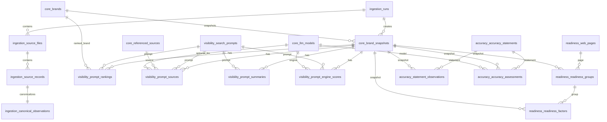

# BrandRank PostgreSQL ERD (Clear Text Version)

## Snapshot grain

- `core.brand_snapshots` models `Brand + IngestionTimestamp`.
- Child facts are not keyed by snapshot alone; they keep their own UUID primary key plus lineage keys:
  - `snapshot_id`
  - `source_record_id`
  - `canonical_record_id`
  - `schema_contract_version`
  - `adapter_version`
  - `source_file_id` + `source_row`
