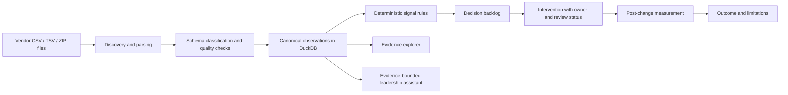

# Codebase Guide for Dhanush

Welcome to the Kenvue Brand Activation Intelligence prototype.

This guide is written for someone who already understands SQL, Python, PySpark, ETL, Power BI, Tableau, and business reporting. The main idea is simple:

> This application turns vendor CSV/TSV data into trusted observations, detects business signals, helps teams decide what to do, and measures whether an intervention worked.

It is closer to a small decision-intelligence product than a traditional dashboard. Power BI or Tableau would usually begin with a curated semantic model and visualize it. This codebase builds that semantic layer, applies governed business rules, exposes the results through an API, and renders the experience in React.

## 1. What the product does

The product supports a closed-loop workflow:



The current POC is configured for:

| Context | Current value |
|---|---|
| Brand | Aveeno |
| Market | US |
| Language | en-US |
| Source system | BrandRank |
| Local database | `data/working/bai.duckdb` |
| Input folder | `data/input` |
| Output folder | `data/output` |

These values are configuration defaults, not hard-coded product limitations. They can be changed in `.env`.

## 2. How to think about the architecture

If you come from data engineering or BI, this translation is useful:

| Familiar concept | In this codebase |
|---|---|
| Raw landing zone | `data/input` and files discovered inside ZIP archives |
| ETL job | `backend/app/ingestion/pipeline.py` |
| Schema detection / source adapters | `backend/app/adapters/registry.py` |
| Data-quality quarantine | `file_manifest.ingestion_status` and `ingestion_errors` |
| Canonical fact table | `canonical_observations` in DuckDB |
| Semantic model / metric definitions | `config/schema_registry.yml` and metric contracts in DuckDB |
| KPI / anomaly logic | `config/signal_rules.yaml` plus `backend/app/analytics/signals.py` |
| Power BI/Tableau report pages | React pages under `frontend/src/pages` |
| Report/API semantic contract | Pydantic models in `backend/app/models/schemas.py` |
| Action register / work queue | `interventions` table and `/api/interventions` endpoints |
| Before/after KPI comparison | `backend/app/services/outcomes.py` |
| Governed natural-language analysis | `backend/app/agents/leadership_chat.py` |

The design intentionally separates three concerns:

1. **What the source says** — raw payloads, source rows, canonical observations, and lineage.
2. **What the business rules infer** — signal instances, severity, confidence, and limitations.
3. **What a person decides to do** — interventions, owners, review states, and measured outcomes.

That separation is important. A low vendor score is an observation. A “risk” is a rule-generated signal. A content rewrite is a human-approved intervention. They should not be treated as the same thing.

## 3. Repository map

```text
.
├── backend/
│   ├── app/main.py                 FastAPI application entry point
│   ├── app/api/routes.py           REST endpoints and request orchestration
│   ├── app/ingestion/              File discovery, parsing, and loading
│   ├── app/adapters/registry.py    Header/file-name based schema classification
│   ├── app/analytics/signals.py    Deterministic signal evaluation and persistence
│   ├── app/services/db.py          DuckDB schema and connection management
│   ├── app/services/interventions.py
│   ├── app/services/outcomes.py
│   ├── app/agents/                 Assistant retrieval, prompting, and fallback logic
│   ├── app/models/schemas.py       API response/request contracts
│   └── tests/                      Backend unit, API, ingestion, and workflow tests
├── frontend/
│   ├── src/pages/                  One React page per major product view
│   ├── src/components/             Shared shell, context bar, and UI components
│   ├── src/services/api.ts         Typed-ish client wrapper around `/api`
│   └── src/App.tsx                 Browser routes
├── config/
│   ├── signal_rules.yaml            Thresholds, severity, governance, limitations
│   ├── schema_registry.yml          Supported schema-family hints
│   ├── activation_rules.yml         Activation scoring configuration
│   └── authority_domains.yml        Owned, retailer, and medical authority domains
├── data/
│   ├── input/                       Source CSV/TSV files and sample data
│   ├── working/                     DuckDB runtime state
│   └── output/                      Generated CSV, Parquet, JSON, and Markdown artifacts
├── docs/architecture/               Broader target architecture and data-model notes
└── scripts/                         Ingestion, demo, cleanup, and architecture helpers
```

## 4. Backend request path

The backend starts at [`backend/app/main.py`](../backend/app/main.py). It creates the FastAPI app, enables CORS, mounts the router under `/api`, and converts DuckDB lock errors into a useful HTTP 503 response.

Most behavior is coordinated in [`backend/app/api/routes.py`](../backend/app/api/routes.py). The route layer is intentionally thin enough to read as a product workflow:

- `POST /api/ingest` runs ingestion synchronously.
- `POST /api/ingest/start` starts background ingestion; the UI polls `/api/ingest/progress/{job_id}`.
- `POST /api/signals/evaluate` evaluates and persists signals for the latest run.
- `GET /api/signals` and the signal detail endpoints power the observatory.
- `POST /api/interventions` creates an action linked to a signal.
- `POST /api/interventions/{id}/measure` creates a before/after outcome.
- `POST /api/leadership-chat` retrieves evidence and returns either an LLM synthesis or a deterministic fallback.

The API models live in [`backend/app/models/schemas.py`](../backend/app/models/schemas.py). When adding an endpoint, update the model contract first or alongside the route so the frontend and backend agree on field names and nullability.

## 5. Ingestion: from files to canonical observations

The ingestion pipeline is in [`backend/app/ingestion/pipeline.py`](../backend/app/ingestion/pipeline.py). Its important stages are:

### 5.1 Discover files

[`discovery.py`](../backend/app/ingestion/discovery.py) recursively scans `data/input`. It accepts `.csv`, `.tsv`, and `.zip` files, including nested ZIP files. Each discovered logical file receives a stable `file_id` and content hash.

### 5.2 Parse delimited data

[`parser.py`](../backend/app/ingestion/parser.py) does lightweight but resilient parsing:

- tries UTF-8 with and without BOM, then Latin-1;
- detects comma, tab, semicolon, or pipe delimiters;
- keeps headers and normalized rows;
- records ragged or empty rows as ingestion errors instead of silently dropping them.

### 5.3 Classify the schema

[`adapters/registry.py`](../backend/app/adapters/registry.py) classifies a file using header tokens first, then filename hints. Supported families currently include:

- visibility prompt scores;
- search-term rankings;
- citations;
- readiness scores;
- vulnerability scores;
- claim assessments;
- competitive playbooks;
- brand-reputation scorecards.

If no adapter matches, the file becomes `unsupported_schema`. Non-empty unsupported files are quarantined; they are not promoted into trusted observations.

### 5.4 Deduplicate and load

The pipeline stores a manifest row for every physical/logical file. Exact duplicate payloads remain visible in the manifest but do not create duplicate canonical facts.

The main canonical table is:

```text
canonical_observations
├── run_id
├── record_id
├── file_id / payload_sha256
├── source_row
├── schema_family / module
├── metric_name / metric_value
├── text_value
├── qualifiers_json       original row plus inferred metadata
├── record_hash
├── adapter_version
└── observation_state
```

This is the closest equivalent to a conformed fact layer. The `qualifiers_json` field deliberately preserves source-specific detail that does not yet have a dedicated typed column.

### 5.5 Export artifacts

Each run also writes useful analyst-friendly artifacts to `data/output`:

- `file_manifest.csv` — file-level lineage and quality;
- `canonical_observations.parquet` — queryable canonical facts;
- `schema_registry_report.csv` — discovered schema summary;
- `data_quality_report.json` — counts for files, rows, duplicates, and quarantines;
- placeholder/template files for product truth and activation reporting.

## 6. Signals: deterministic business logic

Signals are not generated by the LLM. The evaluator in [`backend/app/analytics/signals.py`](../backend/app/analytics/signals.py) reads canonical observations and applies deterministic evaluators. The same input and rule version should produce the same output.

The YAML file [`config/signal_rules.yaml`](../config/signal_rules.yaml) owns the business-facing configuration:

- rule ID and version;
- signal type and module;
- enabled/blocked state;
- threshold and comparator;
- severity bands;
- business priority;
- minimum evidence/runs;
- governance status;
- known limitations.

Current rule families include visibility gaps, cross-LLM inconsistency, claim agreement investigations, readiness deterioration, evidence accessibility deficits, competitive playbook gaps, and brand-attribute benchmarks.

### Governance states

| State | Meaning | Can it drive action? |
|---|---|---|
| `GOVERNED` | Metric semantics and dependencies are verified | Yes, subject to workflow review |
| `EXPERIMENTAL` | Useful rule with provisional interpretation | Visible, but limitations must remain explicit |
| `BLOCKED` | Unsafe or unresolved semantic dependency | No intervention should be created |

For example, the current visibility rule is blocked because the meaning and direction of the vendor’s rank value have not been verified. This is a feature, not a missing calculation: the system is preventing a mathematically plausible but semantically unsafe conclusion.

Each persisted signal links back to source rows through `signal_evidence`. That makes it possible to answer: “Which exact file and row caused this finding?”

## 7. Interventions and outcomes

The workflow services are:

- [`backend/app/services/interventions.py`](../backend/app/services/interventions.py) — create, update, list, transition, and generate an intervention brief;
- [`backend/app/services/outcomes.py`](../backend/app/services/outcomes.py) — measure a post-change run against a baseline.

An intervention should capture:

- the linked `signal_instance_id`;
- the business problem and diagnosed cause;
- the recommended action;
- owner, approver, priority, and risk route;
- baseline and target metric values;
- planned, actual, and retest dates.

The state machine prevents arbitrary jumps between workflow states. A blocked signal cannot create an intervention. This is where the data product becomes an operating workflow rather than just an insight report.

Outcome measurement is intentionally conservative. It compares a baseline run and a post-change run, records deltas and confidence, and stores comparison limitations. A metric moving after a change is not automatically proof of causality.

## 8. Frontend: how the UI maps to the backend

The React app is configured in [`frontend/src/pages/App.tsx`](../frontend/src/pages/App.tsx), with shared navigation in [`frontend/src/components/Shell.tsx`](../frontend/src/components/Shell.tsx). API calls are centralized in [`frontend/src/services/api.ts`](../frontend/src/services/api.ts).

| UI route | Purpose | Main API area |
|---|---|---|
| `/` | Executive overview | dataset status, quality, signals, interventions |
| `/signals` | Signal observatory | `/api/signals` |
| `/signals/:id` | Evidence, history, comparisons | signal detail endpoints |
| `/decisions` | Decision backlog | signals grouped by workflow state |
| `/interventions` | Action register | `/api/interventions` |
| `/interventions/:id` | Action detail and measurement | intervention/outcome endpoints |
| `/outcomes` | Before/after results | `/api/outcomes` |
| `/data-trust` | Quality and governance | contracts, blockers, errors, runs |
| `/ingestion` | Ingestion and ontology | manifest, schema summary, coverage |
| `/evidence` | Searchable source evidence | `/api/evidence` |
| `/assistant` | Leadership Q&A | `/api/leadership-chat` |
| `/settings` | Local assistant preferences | browser local storage |

The frontend uses `VITE_API_BASE_URL` when provided; otherwise it calls `/api`, which is suitable for same-origin hosting behind a reverse proxy.

## 9. The assistant and evidence boundaries

The assistant implementation is in [`backend/app/agents/leadership_chat.py`](../backend/app/agents/leadership_chat.py). Its broad flow is:

1. Classify the user’s intent, such as signals, trust, interventions, outcomes, or engine performance.
2. Build a decision context pack for the current assessment run.
3. Retrieve canonical observations, signal evidence, truth records, and limitations from DuckDB.
4. If valid Azure/OpenAI settings exist, ask the configured model to synthesize the answer.
5. If not, return a structured evidence-backed fallback instead of failing silently.
6. Persist the agent run, retrieved record IDs, citations, latency, and fallback status.

The LLM is therefore an explanation and synthesis layer. It is not the source of truth and it does not decide whether a signal fires.

## 10. Local setup on Windows

### Start the backend

From the repository root in PowerShell:

```powershell
cd backend
py -3 -m venv .venv
.\.venv\Scripts\Activate.ps1
python -m pip install -r requirements.txt
python -m uvicorn app.main:app --reload --host 127.0.0.1 --port 8000
```

Verify it from a second PowerShell window:

```powershell
Invoke-RestMethod http://127.0.0.1:8000/api/health
```

OpenAPI documentation is available at <http://127.0.0.1:8000/docs>.

### Start the frontend

In a second terminal:

```powershell
cd frontend
npm install
npm run dev
```

Open <http://localhost:5173>.

### Run a useful first walkthrough

1. Start both services.
2. Open the **Ingestion & Ontology** page.
3. Run ingestion or seed the demo fixtures from the UI.
4. Open **Data Trust** and inspect file counts, duplicates, schema families, and errors.
5. Open **Signals** and inspect governance state, severity, and evidence.
6. Open a signal detail page and follow its evidence back to the file and source row.
7. Create an intervention only after diagnosis/truth validation.
8. Use a later assessment run to measure the intervention outcome.

To seed repeatable demo data from PowerShell:

```powershell
Invoke-RestMethod -Method Post http://127.0.0.1:8000/api/seed-fixtures
Invoke-RestMethod -Method Post http://127.0.0.1:8000/api/signals/evaluate
```

The assistant works without an API key in deterministic fallback mode. Live Azure/OpenAI synthesis requires the relevant values in `.env`; never commit real credentials.

## 11. Tests and verification

Backend tests:

```powershell
cd backend
.\.venv\Scripts\Activate.ps1
python -m pytest -q
```

Frontend tests and production build:

```powershell
cd frontend
npm test -- --run
npm run build
```

The most useful test groups are:

- `test_ingestion.py` — CSV parsing, encoding, and nested ZIP discovery;
- `test_ingestion_progress.py` — background ingestion and re-ingestion guardrails;
- `test_signals.py` — thresholds, severity, evidence links, history, and idempotency;
- `test_truth_validation.py` — truth and content readiness checks;
- `test_interventions.py` — workflow state transitions and outcomes;
- `test_api_endpoints.py` — HTTP-level contracts;
- `test_remediation_smoke.py` — end-to-end smoke coverage for the main POC loop.

## 12. A good way for Dhanush to extend it

### Add a new source schema

1. Put a representative CSV/TSV in a temporary input folder.
2. Add or refine header/file-name detection in `backend/app/adapters/registry.py`.
3. Decide which values belong in typed canonical fields: `metric_name`, `metric_value`, `text_value`, or a future domain table.
4. Preserve the full source row in `qualifiers_json` while the contract is maturing.
5. Add ingestion tests for valid, empty, duplicate, malformed, and unsupported files.
6. Update `config/schema_registry.yml` and the documentation if a new family is supported.

### Add a new signal

1. Define the business question and metric contract first.
2. Add an evaluator in `backend/app/analytics/signals.py` that reads canonical observations.
3. Add the threshold, comparator, severity, governance state, and limitations to `config/signal_rules.yaml`.
4. Attach exact evidence rows through the signal-evidence bridge.
5. Add tests for positive, negative, insufficient-evidence, blocked, and repeated-run cases.
6. Expose it through the existing signals API; the frontend usually needs no structural change if the response contract is compatible.

### Add a new dashboard view

1. Add a function to `frontend/src/services/api.ts`.
2. Add a page under `frontend/src/pages`.
3. Register the route in `frontend/src/pages/App.tsx`.
4. Add navigation in `frontend/src/components/Shell.tsx` if it is a first-class view.
5. Prefer existing response models and reusable UI components.

## 13. Important caveats before calling this production-ready

- DuckDB is the local single-file state store. It is excellent for a POC and analyst workflows, but concurrent multi-user production workloads would likely need a server database or lakehouse-backed design.
- Schema classification is currently heuristic and header-token based. It needs stronger versioned source contracts for a production integration.
- Several signal rules are intentionally `EXPERIMENTAL` or `BLOCKED`; do not present them as verified business KPIs without resolving their metric contracts.
- The current POC is single-brand oriented and defaults to Aveeno/US/en-US.
- CORS is permissive for local development.
- The assistant fallback is a safety mechanism, not a replacement for validating the live LLM configuration.
- Generated files in `data/working` and `data/output` are runtime artifacts; source files belong in `data/input`.

## 14. Suggested first reading order

For a fast but meaningful orientation, read these in order:

1. This guide.
2. [`README.md`](../README.md) for the original product framing.
3. [`backend/app/ingestion/pipeline.py`](../backend/app/ingestion/pipeline.py) for the ETL path.
4. [`backend/app/services/db.py`](../backend/app/services/db.py) for the DuckDB schema.
5. [`config/signal_rules.yaml`](../config/signal_rules.yaml) for business logic and governance.
6. [`backend/app/analytics/signals.py`](../backend/app/analytics/signals.py) for evaluation details.
7. [`frontend/src/pages/App.tsx`](../frontend/src/pages/App.tsx) and [`frontend/src/services/api.ts`](../frontend/src/services/api.ts) for the UI/API contract.
8. [`DEMO_GUIDE.md`](../DEMO_GUIDE.md) for a product walkthrough.

The key question to keep asking while reading is:

> Can I trace this displayed recommendation back to a source file, source row, metric interpretation, rule version, and human decision?

That traceability is the central design principle of the application.
